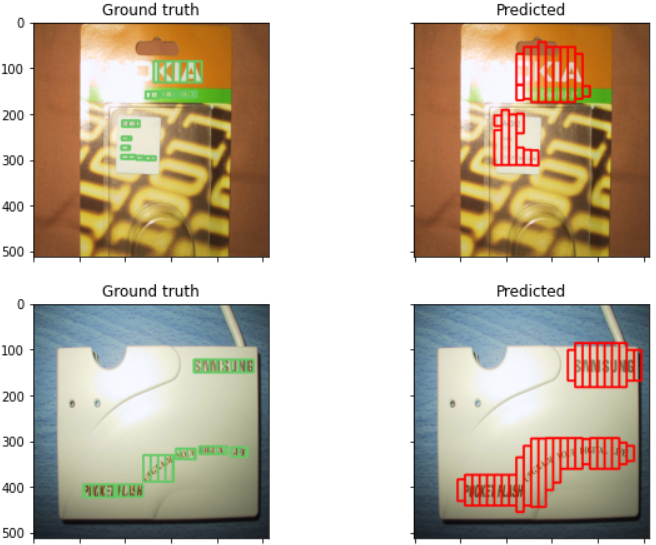
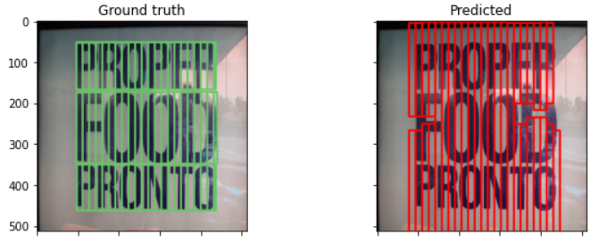

# Text localization in a natural image
The following repository contains code used for detecting presence and location of text in a natural image using Connectionist Text Proposal Network.

## Table of contents
* [File Structure](#file-structure)
* [Model and Dataset](#model-and-dataset)

## File Structure
1. config: Includes details about the directories that are being used for accessing the dataset and checkpoints
2. Dataset_preparation: Includes all the methods used for preprocessing the data including train/test splits of the same.
3. models: Includes implementation of the entire model architecture.
4. train: Code for training the model including hyperparameters settings
6. pred: Used for performing predictions over the image for localizing text.

## Model and Dataset
The model consists of 3 major parts:

1. _Detecting fine-scale proposals_
Detecting text is a tougher task as compared to detecting an object mainly because text does not have a well defined boundary or shape. Therefore instead of predicting a single bounding box for a text word/line fine-scale proposals are proposed. These proposals having a fixed width of 16px each could contain a stroke of a character or a character or an entire word itself.

2. _Region Proposal Network and Fast-RCNN_
CTPN uses the concept of anchor mechanism wherein each the RPN calculates the text/non-text score of each anchor as well as its vertical offset from the groundtruth box. The regressor and classification layers are built on top of VGG16 which is used as the base model.

3. _Recurrently connecting the proposals_
Another distinction between text and objects is that mostly a textual character is contextually related with other characters occurring before and after it. Introducing a BiLSTM layer in the network exploits this aspect of text and helps in reducing false classifications as well as improving localization.

The _Dataset_ used for training the model is the ICDAR 2015 Dataset and testing was done on ICDAR 2013 Dataset. The training set consisted of 1000 images that contained incidental text i.e. images were captured without any explicit focus on the text region. Furthermore the images contained multilingual and arbritarily oriented text.

## Results

The F1 score obtained on the training set was 0.68 with a precision of 0.52 and a recall of 0.99 while for the test set the F-measure, precision and recall were 0.59, 0.48 and 0.78 respectively.

Some examples of text localization by the model are given below:

  

  

  

